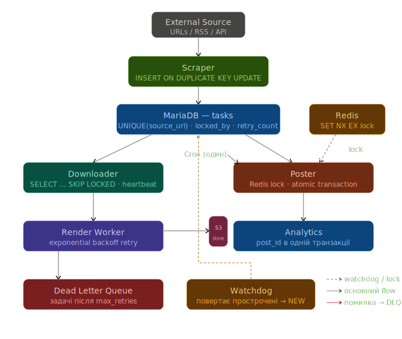

# Media Pipeline: Architecture & Problem Analysis

## 1. Root Cause Analysis

### Проблема 1: Дублі у Scraper (source_url)
Відсутність унікального обмеження (Unique Constraint) на рівні бази даних для поля `source_url`.
Scraper перевіряє існування запису через `SELECT`, потім робить `INSERT` — між цими двома операціями
інший worker встигає зробити те саме (race conditions).

### Проблема 2: Downloader може "залипнути" на задачі зі статусом NEW
Відсутній механізм конкурентної виборки (`SELECT ... SKIP LOCKED`), через що задача може бути
заблокована іншим worker-ом що впав або завис. Немає watchdog процесу, який би повертав такі задачі в чергу.

### Проблема 3: Poster запускається паралельно
Розподілений cron працює без механізму блокування (distributed lock). Два cron triggers запускають
воркер одночасно. Немає distributed lock — обидва вважають, що вони перші.

### Проблема 4: post_id не заповнюється в analytics table
Відсутність атомарної транзакції між публікацією і записом аналітики. Poster спочатку публікує
контент через зовнішній API, отримує `post_id`, і лише потім окремим запитом записує його в `analytics`.
Якщо процес впав між цими двома операціями — зовнішній API вже відповів успіхом, але БД цього не
зафіксувала. `post_id` губиться без можливості відновлення, бо повторний виклик API створить дублікат публікації.

### Проблема 5: Задача втрачається при помилці зовнішнього API без retry
Відсутність retry логіки з exponential backoff та Dead Letter Queue. При помилці зовнішнього API
задача одразу отримує статус `FAILED` без автоматичного re-queue. Немає лічильника спроб (`retry_count`)
і розрахунку затримки між ними. Задачі, що вичерпали всі спроби, не потрапляють в DLQ — вони просто
губляться без можливості ручного перегляду та повторного запуску.

---

## 2. Нова архітектура retry/locking/monitoring

## Схема архітектури



### Locking

- **Scraper:** `INSERT IGNORE` або `ON DUPLICATE KEY UPDATE` замість `SELECT` + `INSERT`.
  Unique constraint на `source_url` гарантує атомарність на рівні БД.
- **Downloader:** `SELECT ... SKIP LOCKED` при виборці задач, щоб конкуруючі workers не блокували
  один одного. Додати поля `locked_by`, `locked_at` і окремий watchdog процес, який раз на N хвилин
  повертає прострочені задачі в статус `NEW`.
- **Poster:** Redis distributed lock (`SET NX EX`) при старті. Якщо lock вже зайнятий — процес
  завершується без виконання.

### Retry

Додати до таблиці `tasks` поля `retry_count`, `max_retries`, `next_retry_at`. При помилці —
збільшувати лічильник і розраховувати затримку за формулою exponential backoff. Задачі що вичерпали
`max_retries` — переводити в статус `DEAD` і писати в `dead_letter_queue`.

### Atomicity

Poster виконує publish і запис `post_id` в `analytics` в одній транзакції. Якщо зовнішній API
відповів успіхом але транзакція не пройшла — задача іде на retry, повторний виклик API ідемпотентний
(або обробляється як дублікат).

### Monitoring

Окремий health check ендпоінт який перевіряє: з'єднання з БД, розмір DLQ, кількість задач що
залипли довше N хвилин. Метрики в Prometheus, алерти через Alertmanager.

---

## 3. SQL-зміни

### Проблема 1: Дублі у Scraper

```sql
ALTER TABLE tasks
ADD CONSTRAINT uq_source_url UNIQUE (source_url);
```

Замість `SELECT` + `INSERT`:

```sql
INSERT INTO tasks (source_url, status)
VALUES ('https://...', 'NEW')
ON DUPLICATE KEY UPDATE updated_at = NOW();
```

### Проблема 2: Downloader залипає

```sql
ALTER TABLE tasks
ADD COLUMN locked_by VARCHAR(128) NULL,
ADD COLUMN locked_at DATETIME NULL;
```

Виборка задачі без блокування інших workers:

```sql
SELECT * FROM tasks
WHERE status = 'NEW'
  AND (locked_at IS NULL OR locked_at < NOW() - INTERVAL 5 MINUTE)
ORDER BY created_at ASC
LIMIT 1
FOR UPDATE SKIP LOCKED;
```

Watchdog — повертає прострочені задачі:

```sql
UPDATE tasks
SET status = 'NEW', locked_by = NULL, locked_at = NULL
WHERE status = 'DOWNLOADING'
  AND locked_at < NOW() - INTERVAL 5 MINUTE;
```

### Проблема 3: Poster race condition

Вирішується на рівні коду через Redis:

```python
lock = redis.set('poster:lock', 1, nx=True, ex=120)
if not lock:
    exit()  # вже запущений
```

### Проблема 4: post_id не записується в analytics

```sql
ALTER TABLE analytics
ADD COLUMN post_id VARCHAR(128) NULL,
ADD COLUMN published_at DATETIME NULL;
```

Poster виконує обидва записи в одній транзакції:

```sql
START TRANSACTION;

UPDATE tasks
SET status = 'POSTED', post_id = '123'
WHERE id = 42;

INSERT INTO analytics (task_id, post_id, published_at)
VALUES (42, '123', NOW())
ON DUPLICATE KEY UPDATE post_id = '123', published_at = NOW();

COMMIT;
```

### Проблема 5: Retry + DLQ

```sql
ALTER TABLE tasks
ADD COLUMN retry_count   TINYINT UNSIGNED NOT NULL DEFAULT 0,
ADD COLUMN max_retries   TINYINT UNSIGNED NOT NULL DEFAULT 3,
ADD COLUMN next_retry_at DATETIME NULL,
ADD COLUMN error_message TEXT NULL;

CREATE TABLE dead_letter_queue (
    id         BIGINT UNSIGNED AUTO_INCREMENT PRIMARY KEY,
    task_id    BIGINT UNSIGNED NOT NULL,
    failed_at  DATETIME NOT NULL DEFAULT NOW(),
    last_error TEXT,
    resolved   BOOLEAN NOT NULL DEFAULT FALSE,
    FOREIGN KEY (task_id) REFERENCES tasks(id)
);
```

---

## 4. Monitoring Stack

### Health checks

Окремий `/health` ендпоінт перевіряє:
- з'єднання з БД
- доступність Redis
- кількість задач що залипли довше N хвилин
- розмір DLQ

### Alerts

Prometheus + Alertmanager. Алерти на:
- DLQ не порожній
- кількість прострочених задач перевищує поріг
- poster lock спрацьовує частіше ніж раз на запуск (означає дублювання cron)

### Dead Letter Queue

Задачі що вичерпали `max_retries` переводяться в статус `DEAD` і записуються в таблицю
`dead_letter_queue` з текстом помилки. Переглядаються вручну або через адмін скрипт для повторного запуску.

---

## 5. Scale-ready для x10 навантаження

- **Scraper і Downloader** масштабуються горизонтально — `SKIP LOCKED` і unique constraint це вже дозволяють.
- **Render Worker** виноситься в окрему чергу (Redis Queue або Celery).
- **Poster** залишається single instance за рахунок distributed lock.
- **БД** — додати read replicas для `SELECT` запитів, connection pooling.
- **Watchdog** виноситься в окремий легкий сервіс.

## 6. Приклади коду

### Scraper — idempotent insert

Замість `SELECT` + `INSERT` використовуємо один запит.
При дублі — просто оновлюємо `updated_at`, задача не створюється повторно.

```python
def scrape_and_save(source_url: str, db):
    db.execute("""
        INSERT INTO tasks (source_url, status)
        VALUES (%s, 'NEW')
        ON DUPLICATE KEY UPDATE updated_at = NOW()
    """, (source_url,))
```

---

### Downloader — SKIP LOCKED + watchdog

`SKIP LOCKED` дозволяє кільком workers брати різні задачі одночасно без блокування.
Watchdog повертає прострочені задачі в чергу.

```python
def acquire_task(db, worker_id: str):
    return db.execute_one("""
        SELECT * FROM tasks
        WHERE status = 'NEW'
          AND (next_retry_at IS NULL OR next_retry_at <= UTC_TIMESTAMP())
        ORDER BY created_at ASC
        LIMIT 1
        FOR UPDATE SKIP LOCKED;
    """)

def watchdog(db):
    db.execute("""
        UPDATE tasks
        SET status = 'NEW', locked_by = NULL, locked_at = NULL
        WHERE status = 'DOWNLOADING'
          AND locked_at < NOW() - INTERVAL 5 MINUTE
    """)
```

---

### Poster — Redis distributed lock

Якщо два cron triggers запускаються одночасно — другий просто виходить.
`nx=True` гарантує що lock може взяти тільки один процес.

```python
import redis
import uuid

r = redis.Redis()

def run_poster():
    process_uuid = str(uuid.uuid4())
    lock = r.set('poster:lock', process_uuid, nx=True, ex=120)
    if not lock:
        return  # вже запущений
    try:
        tasks = db.query("SELECT * FROM tasks WHERE status = 'RENDERED'")
        for task in tasks:
            publish_with_transaction(task)
    finally:
        if r.get('poster:lock') == process_uuid.encode():
            r.delete('poster:lock')
```

---

### Poster — атомарна транзакція

`post_id` записується в `tasks` і `analytics` в одній транзакції.
Якщо щось впало — обидва записи відкочуються разом.

```python
def publish_with_transaction(task, db):
    post_id = external_api.publish(task)

    with db.transaction():
        db.execute("""
            UPDATE tasks SET status = 'POSTED', post_id = %s
            WHERE id = %s
        """, (post_id, task['id']))

        db.execute("""
            INSERT INTO analytics (task_id, post_id, published_at)
            VALUES (%s, %s, NOW())
            ON DUPLICATE KEY UPDATE post_id = %s, published_at = NOW()
        """, (task['id'], post_id, post_id))
```

---

### Retry — exponential backoff + DLQ

При помилці збільшуємо лічильник і відкладаємо наступну спробу.
Після `max_retries` задача іде в Dead Letter Queue.

```python
from datetime import datetime, timedelta

def handle_failure(task, error, db):
    retry_count = task['retry_count'] + 1

    if retry_count >= task['max_retries']:
        with db.transaction():
            db.execute("""
                UPDATE tasks SET status = 'DEAD', error_message = %s
                WHERE id = %s
            """, (str(error), task['id']))

            db.execute("""
                INSERT INTO dead_letter_queue (task_id, last_error)
                VALUES (%s, %s)
            """, (task['id'], str(error)))
    else:
        delay = 30 * (4 ** (retry_count - 1))  # 30s, 120s, 480s
        next_retry = datetime.utcnow() + timedelta(seconds=delay)

        db.execute("""
            UPDATE tasks
            SET status = 'NEW',
                retry_count = %s,
                next_retry_at = %s,
                error_message = %s
            WHERE id = %s
        """, (retry_count, next_retry, str(error), task['id']))
```

### Health Check — FastAPI ендпоінт

Перевіряє стан всіх компонентів системи.
Можна підключити до Prometheus або використовувати як liveness probe в Kubernetes.

```python
from fastapi import FastAPI
from datetime import datetime

app = FastAPI()

@app.get("/health")
async def health(db, redis):
    checks = {}

    # перевірка БД
    try:
        db.execute("SELECT 1")
        checks['db'] = 'ok'
    except Exception as e:
        checks['db'] = f'fail: {e}'

    # перевірка Redis
    try:
        redis.ping()
        checks['redis'] = 'ok'
    except Exception as e:
        checks['redis'] = f'fail: {e}'

    # задачі що залипли довше 10 хвилин
    checks['stuck_jobs'] = db.scalar("""
        SELECT COUNT(*) FROM tasks
        WHERE status IN ('DOWNLOADING', 'RENDERING', 'POSTING')
          AND locked_at < NOW() - INTERVAL 10 MINUTE
    """)

    # розмір DLQ
    checks['dlq_pending'] = db.scalar("""
        SELECT COUNT(*) FROM dead_letter_queue
        WHERE resolved = 0
    """)

    status = 'healthy' if checks['db'] == 'ok' and checks['redis'] == 'ok' else 'degraded'

    return {
        'status': status,
        'timestamp': datetime.utcnow(),
        **checks
    }
```

Приклад відповіді:

```json
{
  "status": "healthy",
  "timestamp": "2024-01-15T10:30:00",
  "db": "ok",
  "redis": "ok",
  "stuck_jobs": 0,
  "dlq_pending": 0
}
```
